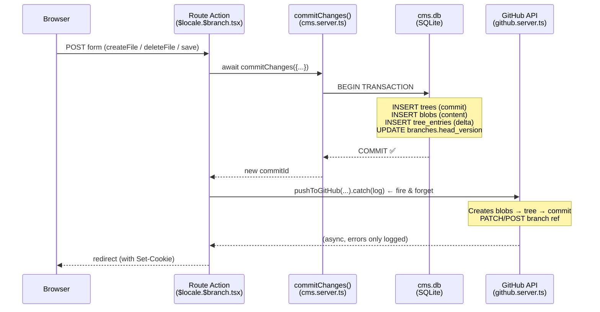
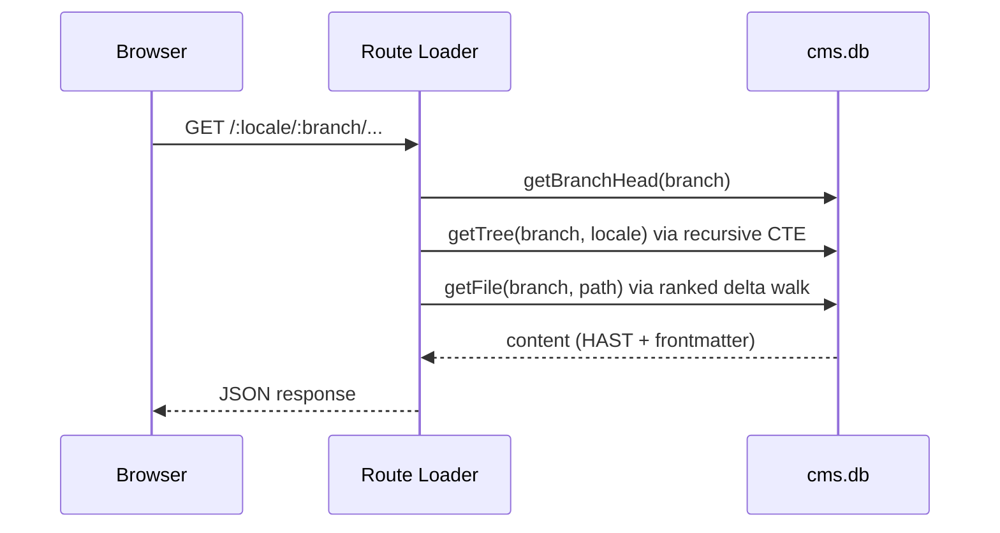

# CMS Data Flow Analysis

## Architecture Overview

The system has **three storage layers** that must stay in sync:

| Layer | Location | Role |
|---|---|---|
| **`cms.db`** (SQLite) | Local file / live server disk | **Source of truth** for all reads |
| **GitHub repo** | Remote | Backup + collaboration + deployment trigger |
| **Browser** | Client-side | Renders content fetched from the server |

---

## Write Flow (User edits content)



> [!IMPORTANT]
> **SQLite is committed FIRST** (line 142-150 in the route). GitHub push is **fire-and-forget** — called with `.catch()` only.  
> The app **never awaits** the GitHub push before redirecting.

---

## Read Flow (User views a page)



**All reads go exclusively to `cms.db`.** GitHub is never consulted at runtime.

---

## Is `cms.db` Always Up-to-Date?

### ✅ On the live server — YES (by design)

- Every write atomically commits to SQLite **before** anything else.
- The app reads only from SQLite. If SQLite has the data, users see it immediately.
- GitHub failure has **zero effect** on what users see.

### ⚠️ On GitHub — NOT GUARANTEED

| Scenario | cms.db | GitHub |
|---|---|---|
| Normal save | ✅ Up to date | ✅ Up to date (async) |
| GitHub token missing | ✅ Up to date | ❌ Never pushed |
| GitHub API 5xx (retry exhausted) | ✅ Up to date | ❌ Missing changes |
| New branch created | ✅ Exists | ✅ Created on first push |
| `publishBranch()` called | ✅ Squash commit written | ❌ **Not pushed to GitHub** |

> [!WARNING]
> **`publishBranch()` does NOT push to GitHub.** It only updates SQLite (`is_draft = 0`, squash commit). If you want publish events to appear in GitHub, you need to call `pushToGitHub` after `publishBranch` completes.

### ❌ `cms.db` is NOT in GitHub

The SQLite database file itself is **never committed to the repo**. GitHub only stores the raw markdown files (`.md`). So:

- GitHub = raw markdown files per branch
- `cms.db` = parsed AST, frontmatter JSON, FTS index, audit logs, branch metadata, delta history

These are **not equivalent** — GitHub doesn't have the processed/indexed form, and `cms.db` has extra metadata GitHub doesn't store.

---

## Delta Storage Model (How cms.db stores content)

```
trees       ← commits (version, parent, author, message)
  └── tree_entries  ← delta per commit (version, path, hash | NULL=tombstone)
        └── blobs   ← deduplicated content by SHA-256 hash
              └── blob_sections_fts ← FTS index per section
```

Queries use **recursive CTEs** to walk back through commit history, picking the most recent (lowest depth) entry for each path. `hash IS NULL` = deleted (tombstone).

---

## Key Gaps / Risks

| Risk | Severity | Notes |
|---|---|---|
| GitHub push fails silently | Medium | Only logged — no retry queue, no webhook re-sync implemented |
| `publishBranch` not synced to GitHub | Medium | Publish event only in SQLite |
| `cms.db` not backed up separately | High | If server disk is lost, all processed content + audit logs are gone |
| No webhook from GitHub → SQLite | — | GitHub is write-only from the app's perspective |
| GitHub token scoped per user session | Low | Push only happens if `user.token` is set on the logged-in session |
